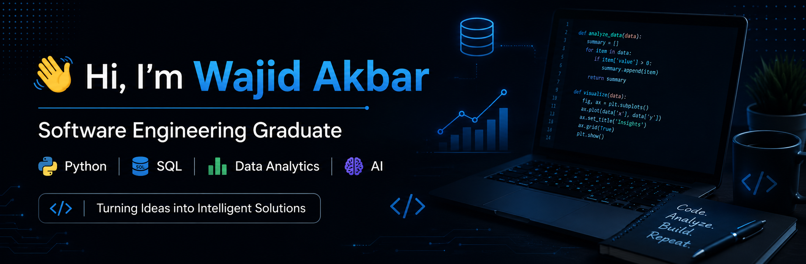

## 🚀 About Me

* 🎓 Bachelor of Science in Software Engineering (BSSE) Graduate from **COMSATS University Islamabad, Abbottabad Campus**
* 💻 Passionate about Python, SQL, Data Analysis, and Software Development
* 📊 Skilled in Data Analytics, Dashboard Development, and Database Management
* 🌱 Continuously improving my problem-solving and programming skills
* 🔍 Interested in AI, Databases, Data Science, and Software Engineering
* 📈 Aspiring Data Analyst and Software Engineer

## 🛠️ Skills & Technologies

### Programming Languages

### Data Analytics

### Web Development

## 📫 Connect With Me

---

⭐ Code, Learn, Build, Repeat.
